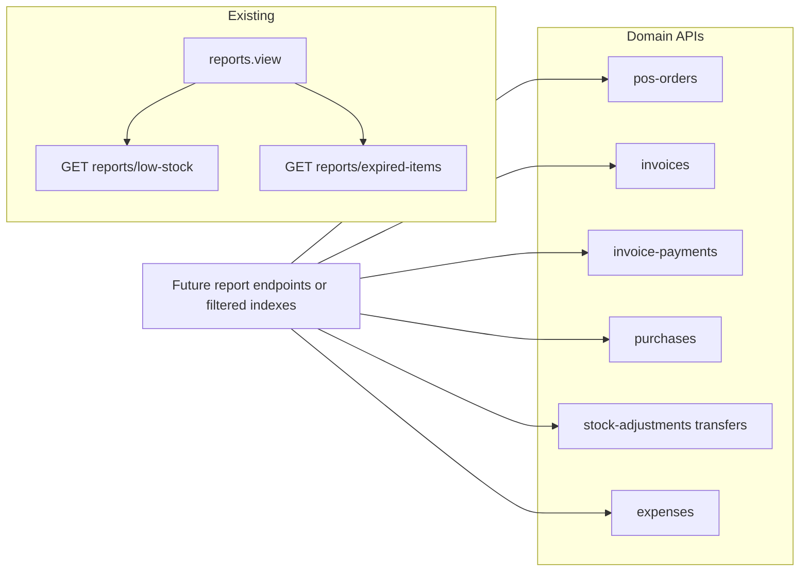

> **Plan file locations (keep in sync):** **This file** — project copy under `docs/plans/` (open from the workspace). **Cursor copy** — `%USERPROFILE%\.cursor\plans\reports_module_scope_cb8b203f.plan.md` (Cursor Plans UI). Mirror substantive edits between both.

# Reports module: what you can cover

## Current state (facts from the repo)

- **TillFlow** ([`src/tillflow/TillFlowApp.jsx`](src/tillflow/TillFlowApp.jsx)): No dedicated “Reports” section yet; [Expired items](src/tillflow/pages/AdminExpiredItems.jsx) and [Low stock](src/tillflow/pages/AdminLowStock.jsx) live under **Inventory** and call `GET /v1/reports/expired-items` and `GET /v1/reports/low-stock` ([`backend/routes/api.php`](backend/routes/api.php) lines 265–268), gated by **`reports.view`** ([`src/tillflow/auth/permissions.js`](src/tillflow/auth/permissions.js)).
- **Laravel API** already exposes rich **list/index** endpoints for sales, purchases, inventory, and expenses (same file): e.g. `pos-orders`, `invoices`, `invoice-payments`, `quotations`, `delivery-notes`, `credit-notes`, `sales-returns`, `purchases`, `purchase-returns`, `stock-adjustments`, `stock-transfers`, `expenses`, `customers`, `suppliers`, etc. These can power **tabular/date-filtered** reports without new entities, once you add **query params** (date range, store, status) or **dedicated aggregate endpoints** where list payloads are too heavy.
- **Legacy theme** ([`src/feature-module/Reports/`](src/feature-module/Reports/), e.g. [`salesreport.jsx`](src/feature-module/Reports/salesreport.jsx)): Many report **layouts** exist but are driven by **static JSON** (`salesreportdata`, etc.)—good for UI reuse, not as source of truth for TillFlow until wired to the API.

---

## Approved UI templates (dev URLs → source files)

Use these as **visual/layout references** when building TillFlow report pages (or when wiring the main app). Routes are registered in [`src/routes/path.jsx`](src/routes/path.jsx) and constants in [`src/routes/all_routes.jsx`](src/routes/all_routes.jsx). Today they mostly load **static JSON** from [`src/core/json/`](src/core/json/)—implementation will swap in API hooks.

| Dev URL (Vite) | Component (under [`src/feature-module/Reports/`](src/feature-module/Reports/)) | Typical API mapping (from this plan) |
| ---------------- | ---------------- | ------------------------------------ |
| `http://localhost:5173/sales-report` | [`salesreport.jsx`](src/feature-module/Reports/salesreport.jsx) | POS / sales summary, date filters → `pos-orders`, payment breakdown |
| `http://localhost:5173/best-seller` | [`bestseller.jsx`](src/feature-module/Reports/bestseller.jsx) | Best sellers / velocity → aggregates on `pos_order_items` + products |
| `http://localhost:5173/stock-history` | [`stockhistory.jsx`](src/feature-module/Reports/stockhistory.jsx) | Stock movement → `stock-adjustments`, `stock-transfers`, optional product join |
| `http://localhost:5173/invoice-report` | [`invoicereportnew.jsx`](src/feature-module/Reports/invoicereportnew.jsx) | Invoice register / outstanding → `invoices`, `invoice-payments` |
| `http://localhost:5173/supplier-report` | [`supplierreport.jsx`](src/feature-module/Reports/supplierreport.jsx) | Purchases by supplier → `purchases`, `suppliers` |
| `http://localhost:5173/customer-report` | [`customerreport.jsx`](src/feature-module/Reports/customerreport.jsx) | Customer analytics / LTV-style → customers + POS + invoices |
| `http://localhost:5173/expense-report` | [`expensereport.jsx`](src/feature-module/Reports/expensereport.jsx) | Expenses by category → `expenses`, `expense-categories` |
| `http://localhost:5173/income-report` | [`incomereport.jsx`](src/feature-module/Reports/incomereport.jsx) | Align with revenue definition (may overlap sales/P&L—confirm product scope) |
| `http://localhost:5173/tax-report` | [`taxreport.jsx`](src/feature-module/Reports/taxreport.jsx) | Tax summary (section G) |
| `http://localhost:5173/profit-loss-report` | [`profitloss.jsx`](src/feature-module/Reports/profitloss.jsx) | P&L (section D) |
| `http://localhost:5173/annual-report` | [`annualreport.jsx`](src/feature-module/Reports/annualreport.jsx) | Yearly rollup (reuse charts/tables; same backend aggregates with year scope) |

**Related (not in your list but same folder / patterns):** `supplierduereport.jsx`, `customerduereport.jsx`, `soldstock.jsx`, `salestax.jsx`—reuse if needed for “due” or alternate tax layouts.

**Additional reports** (no legacy page yet): employee sales (per store), returns by staff, customer purchase history detail, payment breakdown-only view, light Z, return summary—build as **new** TillFlow pages that **only** supply columns + fetcher to the shared report shell (see DRY below).

---

## DRY — Don’t Repeat Yourself

**Goal:** One implementation of “report chrome” (title, date range, optional store, loading/error, table, export); each screen only declares **columns**, **which API** to call, and **how to map** JSON → rows.

| Layer | Do once | Do not |
| ----- | -------- | ------ |
| **Layout / UX** | Single `ReportPage` (or similar) under `src/tillflow/` — page title, filter bar, `DataTable` slot, export button | Copy full `salesreport.jsx` / `bestseller.jsx` structure into 11 separate files |
| **Filters** | Shared hook or small context: `from` / `to` (and `store_id` when migration lands), parse from URL query optional | Per-page `useState` + duplicate date picker wiring 11× |
| **API** | `src/tillflow/api/reports.js` (or extend [`client.js`](src/tillflow/api/client.js)) — `fetchReport(name, params)` thin wrappers; backend groups related aggregates under `GET /v1/reports/...` where it reduces round-trips | Scatter `fetch` URLs and auth headers inside every page |
| **Export** | Reuse existing pattern from [`itemListExport.js`](src/tillflow/utils/itemListExport.js) or one `exportRowsToCsv(columns, rows)` | Duplicate CSV logic per report |
| **Backend** | Shared query scopes or a small `ReportService` for date/store filters; avoid N nearly identical controllers | Copy-paste raw SQL across `*ReportController` classes |
| **Types / labels** | Central map for payment method → display label (cash / card / M-Pesa) used by payment breakdown and Z-light | String switches in every component |
| **Navigation** | Single source: Reports hub links + [`AdminLayout`](src/tillflow/layouts/AdminLayout.jsx) nav group (one list) | Maintain the same links in two nav trees |

**Legacy theme templates** remain **reference screenshots / column ideas**—not files to duplicate line-for-line into TillFlow.

---

## Pre-implementation checklist (order to run before coding)

1. **DRY foundation first:** Add shared layout + filter hook + `reports` API module + CSV helper (`impl-dry-foundation`); then each new page is thin.
2. **Delivery surface:** Confirm whether reports live only under **`/tillflow/admin/reports/*`** (recommended for permissions) or whether you also replace mock data on the **main theme** routes above—record the decision to avoid duplicate UIs.
3. **Template inventory:** Open each JSX file in the table; extract **column definitions and metrics** only—do not port duplicate page wrappers.
4. **API matrix:** For each template row, write the **exact** Laravel endpoints (existing `index` vs new `GET /v1/reports/...`) and **query params** (`from`, `to`, `store_id`, `customer_id`). Flag **blockers:** `pos_orders.store_id` migration for store-scoped sales; **full Z** needs new tables.
5. **Migrations first:** Apply schema prerequisites (e.g. `store_id` on `pos_orders`) before building employee or store-filtered reports.
6. **Permissions:** Map each screen to `reports.view` and/or `sales.manage` / `catalog.manage`; update [`RequirePermission`](src/tillflow/auth/RequirePermission.jsx) routes once.
7. **Hub then vertical slices:** Implement **Reports hub** (links + short descriptions), then **one** thin report page end-to-end using the shared shell; repeat for remaining reports—each addition should be **data + columns only**.
8. **QA:** Spot-check totals against raw DB or Laravel Tinker for one tenant; document rounding and tax assumptions on P&L and tax screens.

---

## Reports you can realistically cover (grouped by domain)

### A. Sales and receivables (high value for retail/POS)

| Report idea                       | Primary data                        | Notes                                                                    |
| --------------------------------- | ----------------------------------- | ------------------------------------------------------------------------ |
| **POS sales summary**             | `pos-orders`                        | By date range, store, payment method; totals, count, average basket.     |
| **Invoice list / sales register** | `invoices`                          | Filter by status, date, customer; aligns with “invoice report” in theme. |
| **Payments received**             | `invoice-payments` (and `indexAll`) | Cash in by period; reconciliation-style.                                 |
| **Aging / outstanding**           | `invoices` + payments               | Needs **balance due** fields on invoice or computed server-side.         |
| **Credit notes**                  | `credit-notes`                      | Volume and amount by period/customer.                                    |
| **Sales returns**                 | `sales-returns`                     | Return rate vs gross sales (needs joins or aggregates).                  |
| **Quotations**                    | `quotations`                        | Pipeline: open vs converted (`convert-to-invoice` flow exists).          |
| **Delivery notes**                | `delivery-notes`                    | Fulfillment vs invoicing if you care about operational KPIs.             |

### B. Inventory and stock control

| Report idea                 | Primary data                           | Notes                                                                   |
| --------------------------- | -------------------------------------- | ----------------------------------------------------------------------- |
| **Low stock**               | `GET /reports/low-stock`               | **Done** in TillFlow.                                                   |
| **Expired / expiring**      | `GET /reports/expired-items`           | **Done** (`scope`, `days` query params in backend).                     |
| **Stock movement**          | `stock-adjustments`, `stock-transfers` | Audit trail by date/reason/store—“stock history” in theme maps here.    |
| **Current stock position**  | `products` (+ variants if applicable)  | Snapshot report; may overlap with product list with export.             |
| **Best sellers / velocity** | `pos-orders` line items + products     | Requires **aggregation** (new endpoint or heavy client work—not ideal). |

### C. Purchasing and payables

| Report idea                      | Primary data             | Notes                                                             |
| -------------------------------- | ------------------------ | ----------------------------------------------------------------- |
| **Purchases by period/supplier** | `purchases`, `suppliers` | Theme “purchase report” / “supplier report”.                      |
| **Purchase returns**             | `purchase-returns`       | Volume and value.                                                 |
| **Supplier due / AP-style**      | `purchases` + payments   | Only if balances/outstanding are modeled consistently on backend. |

### D. Expenses and high-level financial

| Report idea                      | Primary data                        | Notes                                                                                                                                                                                                |
| -------------------------------- | ----------------------------------- | ---------------------------------------------------------------------------------------------------------------------------------------------------------------------------------------------------- |
| **Expenses by category**         | `expenses`, `expense-categories`    | Straightforward tabular + totals.                                                                                                                                                                    |
| **Recurring expenses**           | `expense-recurring-rules`           | Operational, less “financial statement”.                                                                                                                                                             |
| **Profit & loss**                | `pos_orders`, `pos_order_items` + `products.buying_price`, `invoices` (+ lines), `expenses`, `sales-returns` | **Feasible with documented rules**: **Revenue** = sum of completed POS totals (and/or invoiced amounts, depending on whether you double-count POS vs invoiced). **COGS** = Σ line `quantity ×` current `products.buying_price` for lines with `product_id` (POS items do **not** snapshot cost at sale—this is an approximation until you add `cost_price` on line items). **OpEx** = `expenses` in period. **Gross profit** = revenue − COGS; **Net-style** = gross − expenses ± returns adjustments. **Tax** can be summarized from `tax_amount` on POS / invoice lines if you align definitions. Plan as **phase 3** with a short “accounting assumptions” note in UI. |

### E. Staff / employee (tenant users)

“Employee” in TillFlow maps to **`users`** (tenant staff), not the separate **Billers** entity used elsewhere for CRM-style records.

| Report idea | Primary data | Notes |
| ----------- | ------------ | ----- |
| **Sales per employee / Employee sales report** | `pos_orders` | [`PosOrder`](backend/app/Models/PosOrder.php) uses `created_by` → `cashier()` (`User`). Aggregate **completed** orders by `created_by`, filter `completed_at` (and exclude `Voided` if you add void handling in queries). Metrics: `SUM(total_amount)`, `COUNT(*)`, optional average basket, payment mix via `pos_order_payments`. |
| **Returned items processed by each staff member** | `sales_returns` | [`SalesReturn`](backend/app/Models/SalesReturn.php) has `created_by` → `creator()` (`User`). Aggregate by `created_by` with filters on `returned_at`: `SUM(quantity)`, `SUM(total_amount)`, row counts. Multi-line returns: ensure you use **lines** if the business counts line-level qty (controller already loads `lines`). |

**Store dimension (confirmed requirement):** Per **store/location** employee sales are desired. POS checkout already validates `store_id` for stock, but the `pos_orders` row **does not currently persist `store_id`**. Implementation should include: **migration** adding `store_id` (FK to `store_managers`) on `pos_orders`, **populate on create** from checkout payload, **backfill** strategy for historical rows (nullable or best-effort from logs—often left null for old data), then aggregate reports with `GROUP BY store_id, created_by`.

### F. CRM / customer analytics

| Report idea | Primary data | Notes |
| ----------- | ------------ | ----- |
| **Top customers** | `customers` + `invoices` / `pos-orders` | Aggregation by customer (revenue rank). |
| **Billers** | `billers` | Separate from POS cashier; biller-centric workflows, not `pos_orders.created_by`. |
| **Customer purchase history (“what each customer bought”)** | `pos_orders` → `pos_order_items`; `invoices` → `invoice_items` | Both [`PosOrder`](backend/app/Models/PosOrder.php) and [`Invoice`](backend/app/Models/Invoice.php) have `customer_id`. Detail report: list line rows (product, qty, unit price, line total, date from `completed_at` / `issued_at`) filtered by customer, optional date range. Implementation is typically `GET /customers/{id}/purchase-lines` or a report endpoint with `customer_id` + pagination. |
| **Total lifetime value (LTV)** | `pos_orders`, `invoices`, `sales_returns` (optional `credit_notes`) | **Define scope in product copy**: e.g. **LTV** = sum of **completed POS** `total_amount` + sum of **non-cancelled** invoice `total_amount` for that `customer_id`, **minus** sum of `sales_returns.total_amount` (and credit notes if you treat them as reducing customer revenue). Exclude orders/invoices with `customer_id` null (walk-ins). Handle **currency** if multi-currency appears later (currently POS has `currency` on order). |
| **Visit frequency** | same tables | Not stored explicitly—**derive**. Common definitions (pick one and label it in UI): **(1) Transaction count** — `COUNT(*)` of POS orders + invoices linked to the customer (optionally count only POS, or only invoices, if the business treats channels differently); **(2) Shopping days** — count distinct calendar dates where the customer had at least one POS or invoice event; **(3) Time-window frequency** — transactions per month since first purchase. Also surface **first purchase** and **last purchase** dates for context. |

**Caveat — anonymous / walk-in sales:** [`PosOrder`](backend/app/Models/PosOrder.php) allows `customer_id` null with `customer_name` text; those sales **do not** roll into a registered customer’s history unless you later match or require customer at checkout for loyalty reporting.

### G. Payments, tax, end-of-day, and return rollups

| Report idea | Primary data | Notes |
| ----------- | ------------ | ----- |
| **Payment breakdown (cash vs card vs digital wallet)** | `pos_order_payments` ([`PosOrderPayment`](backend/app/Models/PosOrderPayment.php) `method`), `invoice_payments` ([`InvoicePayment`](backend/app/Models/InvoicePayment.php) `payment_method`) | Aggregate `SUM(amount) GROUP BY method` for a date range (and optionally **store** once `store_id` exists on `pos_orders`). **UI mapping:** `cash` → Cash; `card` → Card; **`mpesa`** → label as **digital / mobile money** (closest to “digital wallet” in current enums); `bank_transfer`, `cheque`, `other` as separate rows. **Invoice** side uses the same method constants plus `opening_balance`. Combine POS + AR in one view or separate tabs to avoid double-counting when a sale is both POS and invoiced (usually POS-only vs invoice-only channels). |
| **Outstanding payments** | `invoices` | **Receivables:** rows where **balance due** \( \approx `total_amount` − `amount_paid` \) &gt; 0 and status is not **Cancelled** / **Draft**. [`Invoice`](backend/app/Models/Invoice.php) already tracks `total_amount`, `amount_paid`, and status; expose a filtered list or aged buckets (optional: bucket by `due_at` vs today). |
| **Tax summary — taxes collected** | `pos_orders.tax_amount`; `pos_order_items` / `invoice_items` (`tax_percent`, line math) | **Collected tax (POS):** sum `tax_amount` on completed orders in range. **Detail:** derive per-line tax from items if you need reconciliation with headers. **Invoices:** sum tax implied by line rows (lines store `tax_percent` and `line_total`). |
| **Tax category performance** | same + `products.category_id` | There is **no separate “tax category” table** in the schema—tax is **per-line `tax_percent`**. Practical interpretations: **(1)** group sales by **`tax_percent` bucket** (e.g. 0%, 8%, 16%); **(2)** group by **product category** and show tax collected per category (join lines → `product_id` → category). Pick one and name it clearly in the UI. |
| **End-of-day (Z report)** — final daily sales; paid in / paid out; cash drawer totals | **Gap:** no `cash_drawer`, **paid in**, or **paid out** entities found in backend search | **V1 “light Z”** can still report: **gross POS sales** for the day (`pos_orders` by `completed_at` date), **payment mix**, **return totals**, and **invoice payments** received—using existing tables. **Full retail Z** (expected cash in drawer, paid ins/outs, over/short) requires **new domain model**: e.g. **register sessions** (open/close), **cash movements** (paid in/out), optional **denomination counts**—plus POS UI flows to record them. Plan **phase 2/3** for schema + API after requirements are fixed. |
| **Return summary (total returns)** | `sales_returns` (+ `sales_return_lines` if line detail) | Rollup: `COUNT(*)`, `SUM(total_amount)`, `SUM(quantity)` (or sum line qty), by **date range**, **store** (`store_id` on return), **status** / **payment_status**. Complements per-staff return processing (section E). |

---

## Suggested phasing

1. **Phase 1 – “Reports” hub in TillFlow**: Single nav entry (`/tillflow/admin/reports`) listing **inventory reports** (move or link existing low-stock / expired-items) + **short descriptions** and export where tables already exist.
2. **Phase 2 – Tabular operational reports**: Sales (POS + invoices), payments, purchases, expenses—mostly **filtered list views** with CSV export, using extended query parameters or thin `GET /reports/...` wrappers that delegate to existing queries.
3. **Phase 3 – Analytics**: Best sellers; **P&L** (revenue, COGS from `buying_price`, expenses, returns); **employee sales** and **returns by staff** (group by `created_by`); **customer LTV**, **purchase history**, and **visit frequency**; **payment breakdown**; **outstanding receivables**; **tax summary**; **return summary** rollups; **light Z** (daily sales + payment mix from existing data). **Full Z / drawer** deferred until cash-session schema exists.

---

## Decisions to align before implementation

- **Per-store employee sales**: User preference is **per-store** metrics; plan assumes **`store_id` on `pos_orders`** (see Staff section).
- **Audience**: Will **view-only report users** have only `reports.view`, or should some reports require `sales.manage` / `catalog.manage` because they expose line-level PII or cost?
- **Scope**: Build reports **only under TillFlow**, or also **wire legacy theme pages** to the API (larger surface).
- **Multi-store**: Confirm whether all reports must filter by **store** (POS and stock are store-aware in many POS products).
- **Visit frequency definition**: Confirm whether “visit” means **transaction count**, **distinct purchase days**, or another rule—drives SQL and how you compare customers.
- **Z report depth**: Confirm whether **light Z** (sales + payments from existing tables) is enough for v1, or **full drawer reconciliation** (paid in/out, opening/closing float) is required—latter implies new backend tables and POS workflows.

This document defines **which report types fit your current API** and **what extra backend work** the heavier financial/analytics reports imply.
